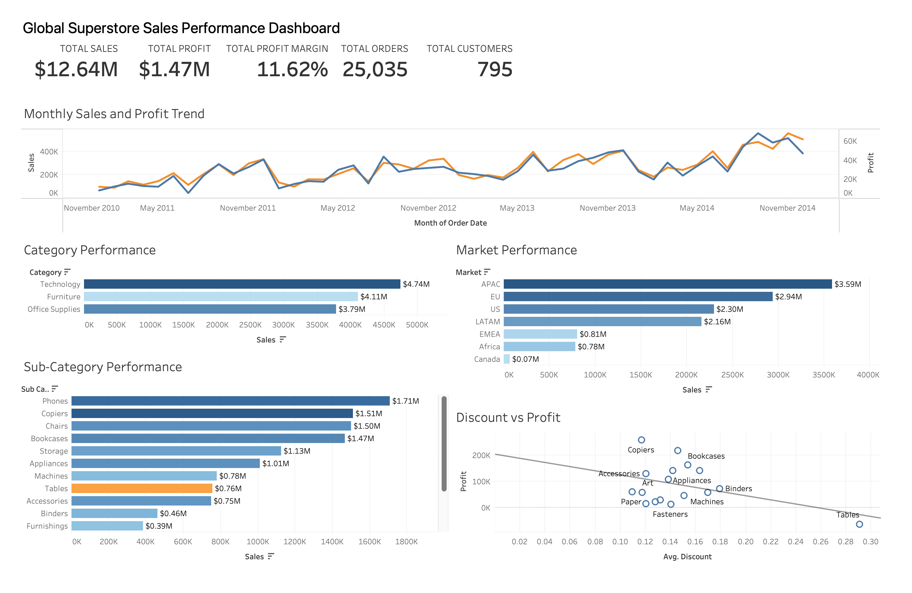
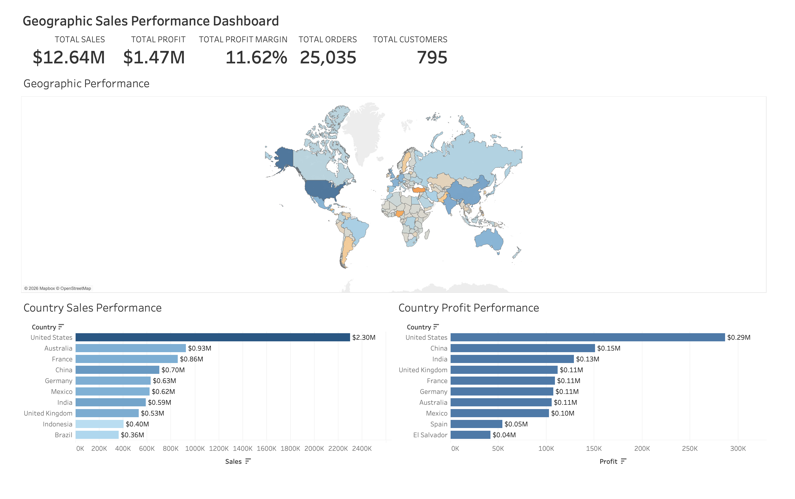

# Global Superstore Sales Performance Dashboard

## Project Overview

This project analyzes the Global Superstore sales dataset to identify sales trends, profitability, product performance, and geographic performance across different markets and countries.

The data was cleaned and prepared using Python before being visualized in Tableau. Two interactive dashboards were created to provide an overall view of business performance and a more detailed geographic analysis.

## Tools Used

- Python (Pandas) – Data cleaning and preparation
- Tableau – Data visualization and interactive dashboards
- Google Colab – Python development environment

## Key KPIs

- Total Sales: $12.64M
- Total Profit: $1.47M
- Profit Margin: 11.62%
- Total Orders: 25,035
- Total Customers: 795

## Dashboard 1 – Sales Performance Overview

The main dashboard provides an overview of:

- Monthly sales and profit trends
- Category performance
- Sub-category performance
- Market performance
- Relationship between discount and profit

## Dashboard 2 – Geographic Sales Performance

The geographic dashboard provides:

- Global sales and profit performance by country
- Top 10 countries by sales
- Top 10 countries by profit
- Interactive country selection that updates the dashboard KPIs and charts

## Key Insights

- Technology generated the highest sales among the three product categories.
- APAC was the highest-performing market by sales.
- The United States generated the highest country-level sales and profit.
- Higher discount levels are generally associated with lower profitability.
- Country rankings differ between sales and profit, showing that higher sales do not always translate directly into higher profit.

## Dataset Source

The original dataset used for this project is the SuperStore Sales Analytics dataset available on Kaggle.

[SuperStore Sales Analytics – Kaggle](https://www.kaggle.com/datasets/thuandao/superstore-sales-analytics)

The original data was cleaned and prepared using Python (Pandas) before being used for the Tableau analysis and dashboards.
