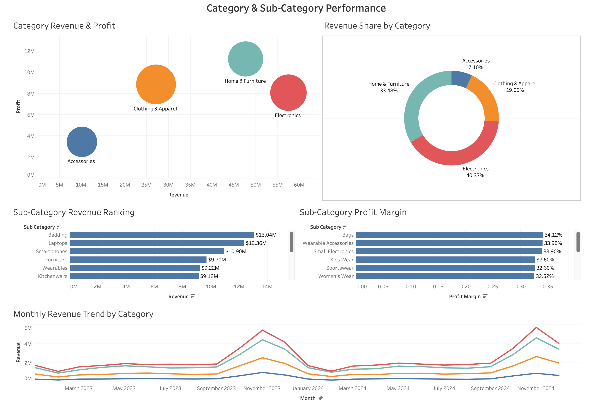

# Product Performance Analysis

## Project Overview

This project analyzes product sales performance to identify best-selling and underperforming products and understand which product categories and sub-categories contribute most to business performance.

The data was cleaned and prepared using Python before being analyzed and visualized in Tableau. Two dashboards were created to examine product-level performance, revenue concentration, category and sub-category performance, profitability, and monthly revenue trends.

## Tools Used

- Python (Pandas) – Data cleaning, validation, and preparation
- Tableau – Data analysis, visualization, and dashboard development
- Google Colab – Python development environment

## Business Questions

The analysis was designed to answer:

- Which products generate the highest revenue?
- Which products are performing strongly and which are underperforming?
- Is revenue concentrated among a small number of products?
- Which categories contribute the most revenue and profit?
- Which sub-categories generate the highest revenue and profit margins?
- How does category revenue change over time?

## Dashboards

### Product Performance Dashboard

This dashboard analyzes overall product performance using revenue, profit, units sold, profit margin, product rankings, a product performance matrix, monthly revenue trends, and Pareto analysis.

### Category & Sub-Category Performance Dashboard

This dashboard provides a deeper analysis of category and sub-category performance, including revenue contribution, profitability, revenue share, and monthly revenue trends by category.

## Key Insights

- Electronics generated the largest share of total revenue at 40.37%, followed by Home & Furniture at 33.48%, Clothing & Apparel at 19.05%, and Accessories at 7.10%.
- Home & Furniture generated the highest total profit despite Electronics generating the highest revenue, showing that higher revenue does not necessarily result in higher profit.
- Tempur-Pedic Mattress, Instant Pot, and MacBook Air were among the highest-revenue products.
- Bedding was the highest-revenue sub-category at approximately $13.04M, followed by Laptops at $12.36M and Smartphones at $10.90M.
- Bags, Wearable Accessories, and Small Electronics showed some of the highest profit margins among the sub-categories.
- Approximately 30 of the 49 products were required to generate 80% of total revenue, indicating that revenue was distributed across a relatively broad range of products rather than being dominated by only a few.
- Category revenue showed strong increases toward the end of both 2023 and 2024, particularly for Electronics and Home & Furniture.

## Business Recommendations

- Prioritize high-revenue products while monitoring both revenue and profitability rather than evaluating performance based on sales alone.
- Investigate products located in the low-revenue and low-profit area of the product performance matrix to determine whether pricing, promotion, inventory, or product rationalization actions are needed.
- Maintain focus on Home & Furniture because of its strong profit contribution, while reviewing opportunities to improve the profitability of high-revenue Electronics products.
- Explore opportunities to increase sales volume in high-margin sub-categories such as Bags, Wearable Accessories, and Small Electronics.
- Prepare inventory and marketing activities ahead of the recurring late-year increase in category revenue.
- Maintain a broad product strategy because the Pareto analysis shows that revenue is not dependent on only a small group of products.

## Dataset Source

The original dataset used for this project is the Product Sales Dataset (2023–2024) available on Kaggle.

[Product Sales Dataset (2023–2024) – Kaggle](https://www.kaggle.com/datasets/yashyennewar/product-sales-dataset-2023-2024)
