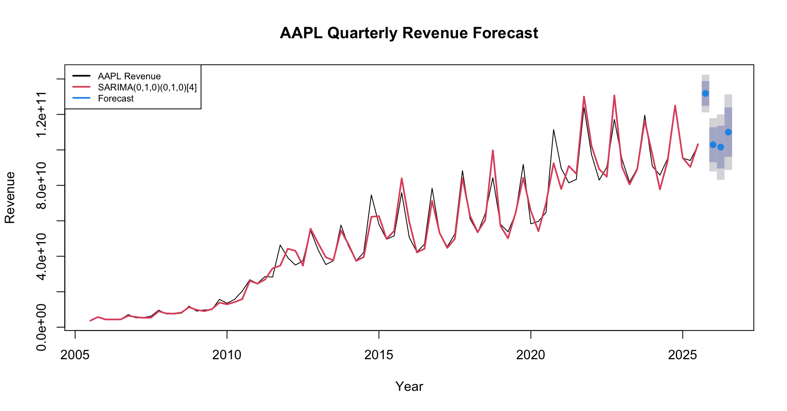

# AAPL Revenue Time Series Forecasting

## Project Overview

This project analyzes Apple (AAPL) quarterly revenue and applies time series forecasting to predict future revenue. Historical revenue patterns were examined to identify trend and seasonality before developing and evaluating a SARIMA forecasting model.

## Business Questions

1. What trends and seasonal patterns exist in AAPL quarterly revenue?
2. Can a SARIMA model forecast AAPL revenue on unseen periods?
3. What is the expected AAPL revenue for the next four quarters?

## Dataset

The project uses corporate financial income statement data containing quarterly financial information for multiple publicly traded companies.

AAPL was selected for the forecasting analysis, with `totalRevenue` used as the target time series.

The dataset was obtained from [Kaggle – Companies Financial Income Statements](https://www.kaggle.com/datasets/emranalbiek/companies-financial-income-statements/data).

## Tools & Techniques

- R
- RStudio
- Time Series Analysis
- ADF & KPSS Tests
- Canova-Hansen Test
- ACF & PACF Analysis
- SARIMA
- Train-Test Evaluation
- Forecast Accuracy Metrics

## Analysis Process

AAPL quarterly revenue was converted into a time series with a frequency of 4. Stationarity and seasonality were examined using ADF, KPSS, Canova-Hansen, `ndiffs()`, `nsdiffs()`, ACF and PACF analysis.

The data was then split chronologically into 70% training and 30% testing data. Based on the time series analysis and `auto.arima()`, a **SARIMA(0,1,0)(0,1,0)[4]** model was developed and evaluated on the unseen test period.

After evaluation, the model was retrained using all available AAPL revenue data to forecast the next four quarters.

## Key Findings

### 1. What trends and seasonal patterns exist in AAPL revenue?

AAPL quarterly revenue shows a strong long-term upward trend together with recurring quarterly seasonal fluctuations.

The time series required both regular and seasonal differencing, with the quarterly seasonal cycle represented by a frequency of 4.

### 2. How well did the SARIMA model forecast unseen data?

| Metric | Training Set | Test Set |
| --- | ---: | ---: |
| RMSE | $4.26B | $27.47B |
| MAE | $2.59B | $24.68B |
| MAPE | 6.69% | 25.61% |
| MASE | 0.46 | 4.35 |
| ACF1 | -0.057 | 0.654 |
| Theil's U | N/A | 1.11 |

The model achieved a **6.69% training MAPE** but a higher **25.61% test MAPE**, showing that forecasting unseen revenue was considerably more difficult than fitting historical data.

The test MASE above 1 and Theil's U above 1 also indicate that the model did not outperform simple benchmark forecasting on the test period. This highlights the limitation of using historical revenue patterns alone to forecast real company performance.

### 3. What is the forecast for the next four quarters?

| Quarter | Forecast Revenue | 80% Prediction Interval | 95% Prediction Interval |
| --- | ---: | ---: | ---: |
| 2025 Q4 | $131.84B | $124.87B – $138.80B | $121.18B – $142.49B |
| 2026 Q1 | $102.90B | $93.05B – $112.74B | $87.83B – $117.96B |
| 2026 Q2 | $101.57B | $89.51B – $113.64B | $83.12B – $120.02B |
| 2026 Q3 | $110.00B | $96.07B – $123.93B | $88.70B – $131.30B |

The forecast continues the quarterly seasonal pattern observed in historical AAPL revenue, with the highest forecast occurring in **2025 Q4 at approximately $131.84B**.

## Forecast Visualization

The black line represents actual AAPL revenue, the red line represents the fitted SARIMA model, and the blue section represents the future forecast with prediction intervals.

## Conclusion

The analysis identified strong growth and quarterly seasonality in AAPL revenue. A SARIMA model was able to capture much of the historical pattern, although its weaker performance on unseen data shows the difficulty of forecasting real corporate revenue using historical patterns alone.

The project demonstrates how time series analysis can be used not only to generate future forecasts, but also to evaluate forecast reliability before using the results for financial decision-making.
